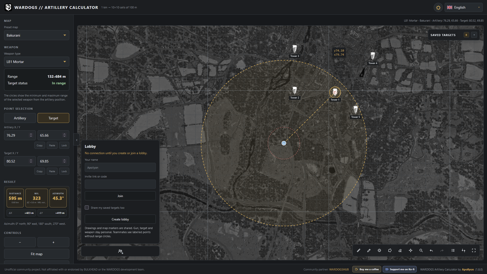

# WARDOGS Artillery Calculator

[](https://wardogs-artillery.com/)
[](LICENSE)
[](https://developer.mozilla.org/en-US/docs/Web/JavaScript)
[](https://pages.github.com/)

A lightweight, open-source artillery calculator and tactical map tool for **WARDOGS**.

**Live app:** https://wardogs-artillery.com/



---

---

## Documentation

Detailed documentation is split into focused files to keep this README concise.

- [Features & weapons](docs/features.md) — calculator features, Map Tools, weapons, shortcuts, and coordinate system
- [Maps](docs/maps.md) — map configuration, tile structure, bounds, and adding new maps
- [Localization](docs/localization.md) — supported languages, automatic language selection, localized URLs, and page sources
- [Development](docs/development.md) — project structure, technologies, local development, build process, and deployment
- [Message of the Day](docs/motd.md) — MOTD configuration and behavior
- [Contributing](docs/contributing.md) — contribution guidelines
- [License & Disclaimer](docs/legal.md) — MIT scope, third-party assets, and project disclaimer

## Quick Start

```bash
npm run build
cd dist
python -m http.server 8000
```

Then open `http://localhost:8000/`.

## Contributing

Corrections, map data improvements, localization updates, bug fixes, and QoL improvements are welcome.

See [Contributing](docs/contributing.md) for details.

## License

Original project source code is licensed under the [MIT License](LICENSE).

WARDOGS assets and other third-party materials are not covered by the MIT License. See [License & Disclaimer](docs/legal.md) for details.
